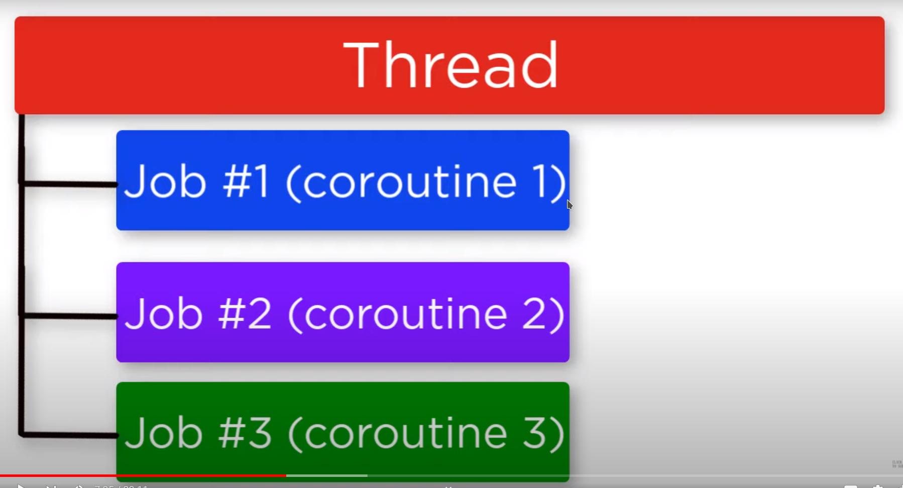

# [Refrence]([Explain coroutines like I&#39;m five - DEV Community](https://dev.to/thibmaek/explain-coroutines-like-im-five-2d9))

## Async

I think the term "async" is a bit misleading - the asynchronous thing is the underlying mechanism, and all these async frameworks are trying to give you a synchronous API to it.

The problem async trying to solve is that IOs are slow, **but suffer very little performance hit when parallelized**. So if you have 10 IOs that take one second each, running them synchronously one after the other will take 10 seconds:

```
for io in ios:  # 10 iterations
    io.start()  # so fast we are not going to measure it
    io.wait()  # takes 1 second
    process_result(io.result)  # so fast we are not going to measure it# Overall - 10 sconds
```

But - if you can perform all of them in parallel it will take one second **total**:

```
for io in ios:
    io.start()
    pending.add(io)

while pending:
    io = pending.poll_one_that_is_ready()
    process_result(io.result)
```

The `for` loop is immediate - all it does is start the IOs(doesn't block) and add them to a data structure. In the second loop, the first iteration will take one second on `poll_one_that_is_ready()`. But during that second, the other 9 IOs were also running so they are also ready - and in the following iterations `poll_one_that_is_ready()` will be immediate. Since everything else will also be so much faster than 1 second that it can be considered immediate - the entire thing will run in 1 second.

So, this is what async means - you start an IO and instead of waiting for it to finish you go to do other things(like sending more IOs).

## Reactors

The problem with the above snippet is that writing code like this tends to get complex - especially when you have different kinds of IOs you need to send, with various dependencies on the results of previous IOs. That's the job of reactors - to hold many tasks, know which task waits on what, and decide which task to run next.

My `pending` container and `while` loop form a super-simplified reactor - real asnyc frameworks will usually have a more complex reactors, that can handle multi-stage tasks and different kinds of IOs - but this is outside the scope of this answer. Another shortcoming of my "reactor" is that it can only deal with one task(with different arguments) - running "process_result" on the result. In reality you'll have different kind of IOs that should be handled differently - which brings us to the next section:

## Callback based async

Popularized by AJAX and Node.js, callbacks are a simple way to let the reactor know how to handle your IO. The idea is together with your IO to register a function(the "callback"), and once your IO is ready it'll call your function with it's result:

```
def single_io_1(io):
    io.start()

    def callback(result):
        process_result_1(result)

    pending.add((io, callback))

for io in ios_1:
    single_io_1(io)

def single_io_2(io):
    io.start()

    def callback(result):
        process_result_2(result)

    pending.add((io, callback))

for io in ios_2:
    single_io_2(io)

while pending:
    io, callback = pending.poll_one_that_is_ready()
    callback(io.result)
```

The reactor always receives the callback from `pending`, so it knows how to deal with the different kinds of IOs we register.

This code is easier to manage than directly using the asnyc IO mechanism - but it's still has syntactic overhead compared to synchronous code. To make it look closer to simple synchronous code - we'll need.

## Coroutines

Let's step back a bit from async to talk about coroutines. A regular function/procedure("routine") has a simple flow - you call it, it does it's job, and it returns. Let's take this function that gives us (a prefix of) the Fibonacci sequence:

```
def fib(limit):
    prev = 1
    curr = 1
    result = [prev, curr]

    for _ in range(limit - 2):
        prev, curr = curr, prev + curr
        result.append(curr)

    return result
```

(please ignore that for `limit < 2` you'll get 2 elements)

This is a regular function - it does it's job and then returns. A coroutine, on the other hand, has many points during it's run where it can returns something to it's caller:

```
def fib():
    prev = 1
    curr = 1
    yield prev
    yield curr

    while True:
        prev, curr = curr, prev + curr
        yield curr
```

When we call `fib()`, instead of getting a list we'll get an iterator `it`. Each time we call `next(it)` the function will run until the next `yield` and return that value. So the first two `next(it)` will return `1`, the third(the `yield` in the first iteartion of the `while True:` loop) will return `2`, the fourth(second iteration) will return `3`, the firth will return `5` and so on. The loop is infinite - but it's controlled from the outside(by calling `next`) so the program doesn't get stuck.

This was originally used for iterators, but it can also be used for:

## Async with coroutines(finally!)

Instead of registering a callback function, our "callback" will be the rest of the coroutine after the `yield`:

```
def single_io(io):
    io.start()
    yield
    process_result(io.result)

for io in ios:
    coroutine = single_io(io)
    next(coroutine)
    pending.add(coroutine)

while pending:
    coroutine = pending.poll_one_that_is_ready()
    next(coroutine)  # in real Python this can throw a StopIteration!
```

Now our `single_io` looks almost like synchronous code - and you just need some syntactic sugar to make it look like this:

```
async def single_io(io):
    result = await io.run()
    process_result(result)

for io in ios:
    reactor.add(single_io(io))
```

> **Notice**

So let's start with comparing Kotlin coroutines to other languages coroutines. Basically, you should know that there are two types of Coroutines: **stackless** and **stackful**. Kotlin implements stackless coroutines - it means that coroutine doesn't have its own stack, and that limiting a little bit what coroutine can do.

**Examples:**

- Stackless: C#, Scala, Kotlin
- Stackful: Quasar, Javaflow

> **What it means that coroutine is like light-weight thread?**

It means that coroutine in Kotlin doesn't have its own stack, it doesn't map on a native thread, it doesn't require context switching on a processor.

> What is the difference?



Thread - preemptively multitasking. Coroutine - cooperatively multitasking.

Thread - managed by OS (usually). Coroutine - managed by a user.

A thread is directly linked to the **native thread** in the corresponding **OS** (operating system) and consumes a considerable amount of resources. In particular, it consumes a lot of memory for its stack. That is why you cannot just create 100k threads. You are likely to run out of memory. Switching between threads involves OS kernel dispatcher and it is a pretty expensive operation in terms of CPU cycles consumed.

A coroutine, on the other hand, is purely a **user-level language abstraction**. It does not tie any native resources and, in the simplest case, uses just one relatively small object in the JVM heap. That is why it is easy to create 100k coroutines. Switching between coroutines does not involve OS kernel at all. It can be as cheap as invoking a regular function.

> Are kotlin's coroutines actually running in parallel / concurrently?

It depends, you can run each coroutine in its own thread, or you can run all coroutines in one thread or some fixed thread pool.

A coroutine can be either running or suspended. A suspended coroutine is not associated to any particular thread, but a running coroutine runs on some thread (using a thread is the only way to execute anything inside an OS process). Whether different coroutines all run on the same thread (a thus may use only a single CPU in a multicore system) or in different threads (and thus may use multiple CPUs) is purely in the hands of a programmer who is using coroutines.

In Kotlin, dispatching of coroutines is controlled via ***coroutine context***.

> Here I'm starting 100000 coroutines, what happens behind this code?

Actually, it depends. But assume that you write the following code:

```kotlin
fun main(args: Array<String>) {
    for (i in 0..100000) {
        async(CommonPool) {
            delay(1000)
        }
    }
}
```
