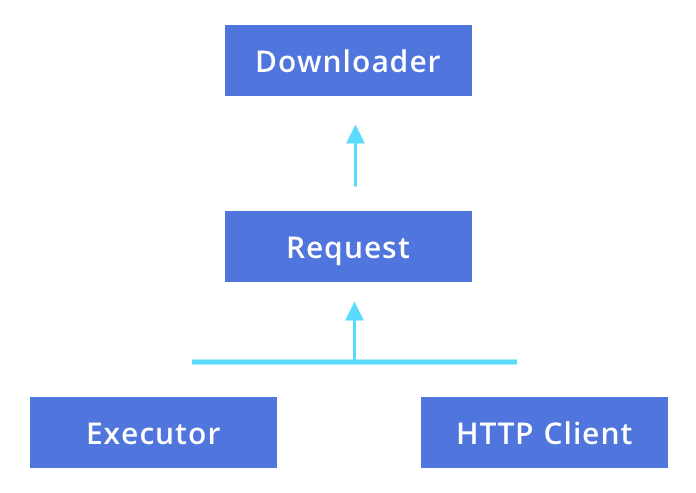

# Why do we use the Dependency Injection Framework like Dagger in Android?

**First, we break the word Dependency Injection and try to understand the meaning of words.**

1. **A <u>dependency</u> is an object which is to be used by a dependent i.e class.**
2. **An <u>injection</u> is a technique that passes the dependency to dependent i.e Object to a class that wants to use it.**

**We create a class named <u>Car</u>. In that, we need an <u>object</u> of Engine class and <u>Steering</u> class. Let’s first implement this scenario in a traditional way without using Dependency Injection. Without using dependency injectionThis code does not follow the principle of Dependency Injection because of the following reasons:**

1. **Here <u>Car</u> class constructing its own Engine and Staring objects. This our code is <u>tightly coupled</u>. So if we want to change the Steering type from normal to power steering, you have to create two types of <u>Car</u>.**
2. **Hard dependency on <u>Steering</u> and <u>Engine</u> makes testing more difficult, because of <u>Car</u> use the real instance of <u>Engine</u> and <u>Steering</u>, thus preventing you to do Unit Testing because of its use real object of <u>Engine</u> and <u>Steering</u> we can not modify objects for testing in different cases.**
3. **Not an easy task to maintain this type of code because no subclasses or alternative implementations can be easily used.**

```kotlin
class Car {

    private val engine = Engine()
    private val steering = Steering()

    fun start() {
        engine.start()
    }
}

fun main(args: Array) {
    val car = Car()
    car.start()
}
```

**We have two approaches to solve this issue. In both methods we are trying to make our code loosely coupled. For that, we are removing the dependency of the <u>Engine</u> and <u>Steering</u> class from the <u>Car</u> class. To achieve this, let’s look into the following methods:**


## Constructor Injection

**In this, we are passing the dependencies by the <u>constructor</u> so our Car object does not depend upon <u>Engine</u> or <u>Staring</u>.**

**With the use of the <u>Constructor Injection</u> dependency injection**


```kotlin
class Car(private val engine: Engine, private val steering: Steering) {
    fun start() {
        engine.start()
    }
}

fun main(args: Array) {
    val engine = Engine()
    val car = Car(engine)
    car.start()
}
```

## Field Injection (or Setter Injection)

**In Android, we have certain Android framework classes like activity or fragment which instantiated by the system, so constructor injection is not possible. So we are using <u>Field Injection</u> in which dependencies are instantiated after the class is created.**

**With the use of the Field Injection dependency injection**

```kotlin
class Car {
    lateinit var engine: Engine
    lateinit var steering: Steering

    fun start() {
        engine.start()
    }
}

fun main(args: Array) {
    val car = Car()
    car.engine = Engine()
    car.steering = Steering()
    car.start()
}
```

**We can see this code is much more maintainable and loosely coupled. This is called *dependency injection by hand*, or *manual dependency injection.***

**But this small example. Real Car depends on many other classes like Sheets, Shape, Windows and many more. If we try to fit all this class dependancy manually than its more tedious work and you face the following problems.**

1. **In the real world app, taking all the dependency and connecting them correctly is required lots of effort and a large amount of boilerplate code.**
2. **If you want to create an object in the top layer, you have to provide all the dependency on their lower-level classes.**
3. **In some cases, we are not able to construct dependencies before passing them into the target class which requires those dependencies. For Example if you are using lazy initializations than you need to manage custome containers, that maintain lifetimes of your dependencies in memory.**

**So Dependency Injection is a technique that makes dependent i.e class independent of its dependencies.**

**We might or might not have used a dependency framework in our project. In this blog, we are going to discuss why we need a dependency framework and why it is useful to use one in our project.**

- **Consider, that when we have to create a lot of objects which are dependent on many other objects in our project, it becomes tough when the project becomes bigger. With the code base increasing, we might need some good external support to manage it all.**

**Consider an example we have two activities, Activity A and Activity B. Both require an object Downloader, in which Downloader will require the request. Now, the request will depend upon Executor and HTTPClient.**

 

**Here, we first create an object of Executor and HttpClient and we pass them to request object like:**

```kotlin
val executor = Executor()
val client = HttpClient()
val request = Request(executor, client)
```

Then we pass request in Downloader:**

```kotlin
val downloader = Downloader(request)
```

**This is how we can create an object for Downloader. Now, consider that we need to use this in both activities(A and B), we need to write all these 4 lines again and again.**

**To reduce writing this code, again and again, we can create a factory class and create the Downloader using:**

```kotlin
val downloader = DownloaderFactory.create()
```

**Where DowloaderFactory is:**

```kotlin
object DownloaderFactory{
    fun create():Downloader{
        val executor = Executor()
        val client = HttpClient()
        val request = Request(executor, client)
        return Downloader(request)
    }
}
```

**This will make the task easy.**

***Dependency Injection in build upon the concept of Inversion of Control which says that a class should get its dependencies from outside. In simple words, no class should instantiate another class but should get the instances from a configuration class.***

**Now, consider, what if we would have just provided some sort of configuration to some framework like the way to create the object, scope(lifecycle), and that framework would have created these types of Factory classes for us. Our task would have become easy. We just had to write some code to provide the configuration to the framework, and the framework would have created the Factory classes for us. We would have just used that.**

**For example, consider we have a birthday party at our place and we need a cake. So, to make a cake on our own takes a lot of effort and perfection. We can just place an order to a bakery, which will act as the framework which will take instructions from us and then deliver the cake to us. Here, we are the *consumer*.**

**Now, let's see how we can give the configuration to the framework.**

#### How can we give our configuration to the framework?


**Using a framework reduces a lot of code written by us. So, in the generic term, we give configuration to the framework like the way to create the object, scope(lifecycle) of the object so that the framework can create dependencies for us, and then consumers can get the dependencies based on a configuration which we had provided.**

**Now, let's consider the example for <u>Dagger</u> framework here:**

**Dagger work on the basis of <u>annotation processing</u> which generates the code for us. Dagger just requires the configuration from us that we provide by creating some classes and interfaces and using annotations along with it.**

**Dagger just requires us to give the configuration for the required dependency and rest it takes care of using the annotation we have provided by generating the code internally.**

#### Conclusion

**We should use the dependency framework because of the following:**

- **It helps us in managing the complex dependencies easily.**
- **It makes the unit testing easy by enabling us to pass all the dependencies from outside so that we can easily use the mocked objects.**
- **It easily manages the scope(lifecycle) of the object.**

**This is why we need to use Dependency Injection Framework like Dagger in Android.**


